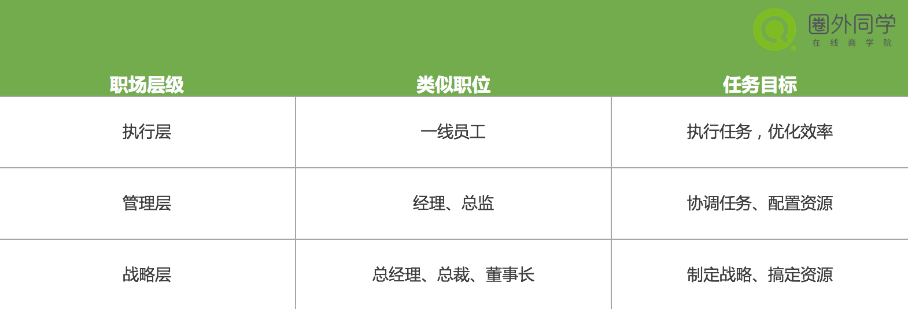

#一、序

我们常会碰到一些临场发言的情况，但经常不能组织好回答逻辑，发言总是东一茬西一茬的，让领导听得频频皱眉。事后，我们总是后悔自己没能回答好领导的问题，明明想法还挺好的，如果自己能说得更有条理一些，那该有多好啊~

这个情况，也同样会发生在吵架之后，每次吵架之后，都觉得如果再来一次，可以吵地更好可是，时光不会倒流， 我们如何才能做到快速又清晰地表达自己的观点呢？

今天，让我们一起通过3个具体场景，感受下套用架子会带来怎样的威力。接下来你会很快发现，有了表达框架时，我们也可以快速而又有条理地将自己的想法讲出来~

#PDCA工作管理模型

##当领导询问你的工作计划

想象一下这个场景：如果你是公司的HR，领导在走廊上遇见你，突然问你近期给公司制定的招聘计划是什么。

这时你该怎样在短期内给领导一个满意的回答？

我们可以用点时间来思考下，作为一个HR，你怎样才能快速而又有条理的，把自己的工作解释给领导听，让领导认可你的招聘计划。是不是觉得，即便招聘就是每天在进行的工作，但突然要进行回答时还是非常混乱，头脑里可能同时出现一大堆信息，让你一时不知该从哪里开始答起。

这里有一个很好用的模型可以作为框架，当你需要解释工作计划时入，PDCA工作管理模型可以帮你快速搭建起回答内容。

什么是PDCA呢？
PDCA是英语单词

- Plan(计划)
- Do(执行)
- Check(检查)
- Action(处理)

### P (plan) 计划，包括方针和目标的确定，以及活动规划的制定。

### D (Do) 执行，根据已知的信息，设计具体的方法、方案和计划布局；再根据设计和布局，进行具体运作，实现计划中的内容。
### C (Check) 检查，总结执行计划的结果，分清哪些对了，哪些错了，明确效果，找出问题。
### A (Action)处理，对总结检查的结果进行处理。

其实这可以归类于课程中所讲的时间架——在行动前的方案计划，在行动中的执行、检查，在行动后如何分析复盘。
好了，开始思考，大家就班班给出的场景，利用PCDA来试一下～

其实你可以用PDCA工作管理模型这样回答领导：
我是这样计划（plan）的——本季度部门需要招聘XX人，其中包括XX，XX，XX等不同类型层次、不同岗位招聘。我们目前可使用的资源、渠道有XX，可使用人员有XX，在XX时间前完成招聘目标。
根据计划，我的具体执行（do）是这样的——设计招聘方案，把工作量分配到每人每天进行开展。同时，我在进行过程中，会定时定期进行反馈沟通及调整（Check），保证招聘能够按照所计划的执行。
这一轮的招聘结束后，我会对整个招聘过程进行评价，并对招聘统计情况进行评估分析，将反应结果使用到后续工作中(Action)。对成功的经验加以肯定，并予以标准化；对于失败的教训也要总结，引起重视。

#SWOT分析模型 

##当领导叫你分析问题

如果公司最近有位新入职的员工，在他实习期结束后，领导想知道这位员工到底怎么样，让你谈谈对这位员工的看法，这时你该如何回答呢？
我们可以用点时间来思考下，怎样才能在短时间内，有条理又严谨全面地回答这个问题。

很可能我们在短时间内能想出一些观点来，但这并不是一个成体系的严谨回答，就算提出了一些见解，也并不能让领导感到满意。
但如果你知道企业里常用的SWOT模型分析法的话，就能快速地搭建起一个符合MECE原则的回答。

SWOT模型，

- S （strengths）是优势，
- W（weaknesses）是劣势，
- O （opportunities）是机会，
- T（threats）是威胁。

运用这种方法，我们可以对研究对象所处的情景进行全面、系统、准确的研究。大家更熟悉它在企业分析中的运用，但其实它也在对个人的分析同样也适用。
SWOT模型分析法属于课程中所讲的空间架，优势、劣势、机会、威胁是四个抽象的概念要素，从这四方面出发，可以快速做出一个不重不漏的结构化回答。

比如，你可以用SWOT模型分析法这样回答：
根据这名新员工在公司的表现，我的看法是这样的——这位员工的长板（优势）是XX，他的短板（劣势）是XX。如果我们能够很好地利用他的长板能力，那么他可以给团队带来XX的机会；如果我们让他做了他不适合做的事，会带来的风险是XX。

#职场层级模型

##当领导让你给出建议/方案

如果你进入一家公司几年了，公司有意提拔你做管理层，某天领导突然状似无意地问了你一个问题：你觉得一个企业应该如何培养员工呢？其实企业怎么培养员工是一个大而泛的问题，在短时间内要快速给出建议/方案是很难的。但如果你知道职场层级的概念，或许就能快速给出一个清晰而有洞见的回答。

什么是职场层级呢？
我们可以将职场岗位分为3个层级：

- 执行层、
- 管理层、
- 战略层。

这个概念可以简单清晰地用一张图来解释

这其实这就是我们课程中讲到的程度架，这类模型适用于给出建议/方案。
比如，你可以运用职场层级的概念，这样回答领导：
作为一个企业，职场的层级大概分3层，不同层级有不同的特性。

一个公司最一线的是“执行层”，执行层是完成一个具体任务，目标是完成任务，优化效率。
比“执行层”往上一层的是“管理层”，管理层要负责协调完成所有的任务，并分配资源，实现公司的指标，一般是经理或者总监。

再往前一层是“战略层”，比如一个公司的总经理、总裁，他们的主要工作是制定战略，搞定资源。
对于不同层级的员工，其实他们需要的核心能力是不同的，我们应该根据员工的层级来着重培养他需要的能力。

#总结
大家平时可以多多积累类似的模型，并归类进时间架、空间架、程度架中，每天练习使用架子回答问题。相信经过一段时间的练习后，大家在临场发言时的表现都会有很大改变。

