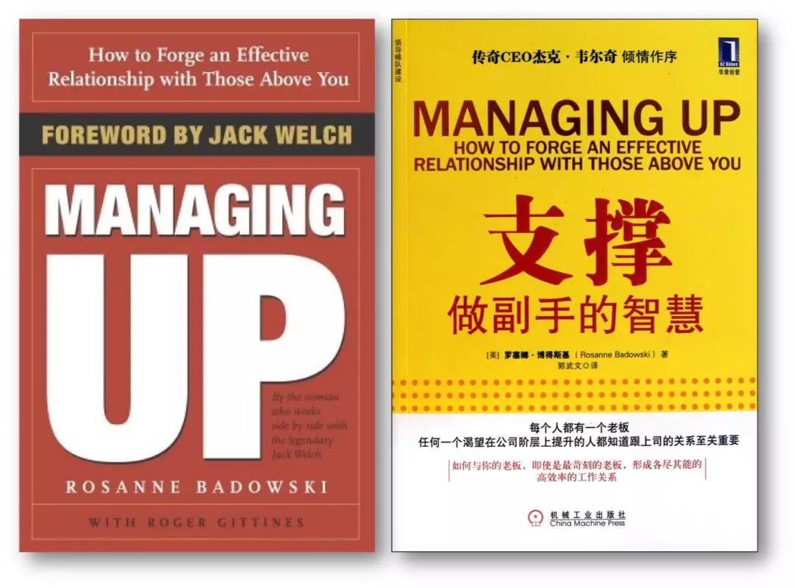
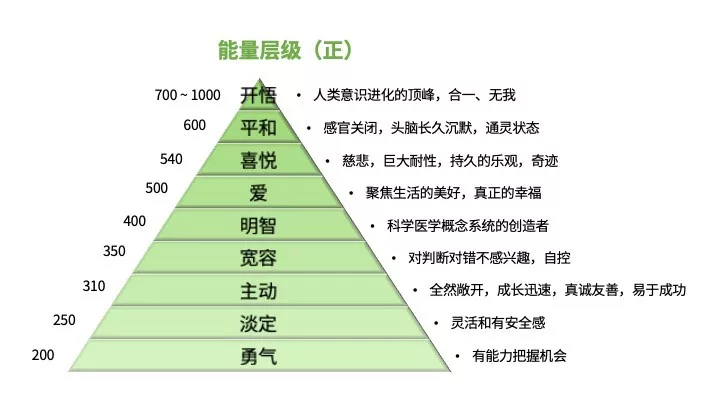
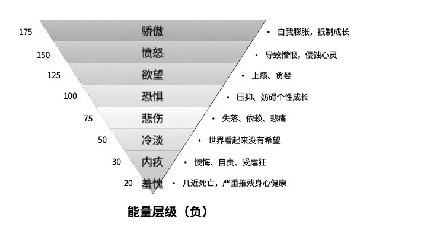

#一、引

班班经常会看到这样的吐槽。

“我的老板遇到事情总是亲力亲为，不信任我，我该怎么办？”

又或者是这样的情况

“一直想和老板搞好关系，可是和老板相处的时候，总是感觉很尴尬，感觉她也不是很喜欢我。偏偏最近又新来了一个实习生，很讨老板喜欢，我该怎么办？”	
	
	
“老板每次给我派活儿，总是不说清楚他想要的是什么，我做了之后又让我不停修改，我该怎么办？”	
在职场中，大部分同学都遇到过类似的困扰。如果仔细分析上面的案例，其实它们有个共同点，大家有没有发现？

这些案例句式都是 

### “我的老板不……我该怎么办？

如果大家再仔细思考一下这个句式，就会发现，它其实是在表达一种心态：我有期待，但我无力改变。
在职场中，「无力感」很容易吞噬我们的情绪，而更可怕的是，它还是个无底洞，会让我们陷入“弱者思维”的恶性循环中。

而那些在职场中游刃有余的人，从来不会被无力感所限制，相反，他们身上拥有的，是一种强烈的「掌控感」从「无力感」到「掌控感」，除了能力上的提升，更为重要的，是心态上的转变。

#二、设么是对上管理

「管理领导」这个观点并不新奇。罗塞娜·博得斯基——传奇CEO杰克·韦尔奇（带领通用电气走向巅峰的人）的得力助手，早在2004年，就把自己14年来的成功经验写成了畅销书，并提出了「向上管理」的概念。

「向上管理」意味着，面对领导，你不再只是处于被动无力的局面，而是能够通过积极主动的策略和行为，对你领导的认知和行为也产生影响。
其实，任何关系都是双方互动的结果。家庭关系、亲密关系、朋友关系，都是由双方共同塑造而成的。同样，上下级关系也是。

上级可以借由自上而下的权力，对下属进行领导、监督和控制。同样地，作为下属，也可以充分发挥自下而上的影响力，对上司进行适应、沟通和反馈。所以，面对老板，你需要的不是默默忍受，也不是溜须拍马，而是适当的「向上管理」。

「向上管理」本质上是在管理三样东西：

1. 工作量
2. 信息量
3. 能量

很多时候我们都会抱怨：“我明明工作都这么多了，领导还给我布置工作，真的是压榨！“这其实就是工作量方面的向上管理出了问题。
而当我们出现，领导让你去做A，结果你做成了B，最后导致屡屡返工。这本质上就是信息量的向上管理没有做好。

同样也是最常见的，每次跟领导沟通完，情绪上都很烦躁、很崩溃，或者很尴尬。这就属于向上管理中的能量维度有待提升。

其实，在职场中，每个人都会面临的一个现状就是：我们的工作量自己会长大。
这本质上是因为，随着我们能力的不断提升，以及对工作内容的逐渐熟悉，我们做一件事情所花费的时间是越来越短的，这意味着，我们会接到越来越多的工作。

但是，每个人所能够承担的工作，都会有一个“上限”，一旦超过了上限，工作不能够定时清空，就会陷入工作越积越多的负面循环。长期下来，“未完成的工作”那个黑洞越来越大，最终全部崩盘，而你也成为被最后一根稻草压死的骆驼。

管理领导给你的工作量，并不等于直接拒绝接受领导布置的工作，而是通过与领导的良性沟通，确保自己的工作量能够基本维持在不超过“上限”的状态。跟领导沟通工作量的方式，是极其关键的，处理不好可能引发更多的问题，敏媛小姐姐分享了两个小技巧。

### 第一，跟领导确认工作优先级。
首先，对于自己手头上的工作，你需要有一张任务清单。很多人的任务清单，上面都需要日期和任务，比如“周一：完成项目方案初稿，发给领导看。这样的任务清单其实是不合格的。在任务清单中，至少还需要两栏:

- 第一栏是重要紧急程度
- 第二栏是预计花费时长。

为什么需要这两栏内容呢？

其实，管理工作量的本质就是确保自己在相应的时间内，完成必须完成的工作。
所以首先，你需要知道自己手头上的所有工作中，在领导眼中的重要紧急程度如何，这决定了工作的优先级。通常，我们先完成“重要紧急“的工作，然后处理”紧急非重要“和“重要非紧急”的工作。
这样基本就能够保证自己不会陷入“领导急着要的、很重要的工作没做”，做的都是“不重要也不紧急”的工作。

以及，为什么需要列出每一项工作的花费时长呢？
因为很可能在领导眼里，每项工作都是重要紧急的。这个时候，你就需要开始“向上管理”了。

你可以告诉领导：

你看，你交给我了ABC三件工作，希望今天都拿到。
其中A工作我需要3小时，B工作我需要2小时，C工作我需要5个小时。
其中，我知道B工作是最紧急的，你需要下午就拿到，所以我会在下午2:00之前把B工作完成给到你，剩下我还有6个小时的工作时间。原本今天需要3小时完成的D工作，和剩下的A工作和C工作，哪一个的优先级更高呢？我可以把优先级最高的工作排到今天完成，剩下的是否可以安排到明天或者后天呢？”

通常情况下，一个正常的领导都能够体谅和理解你，ta会重新思考这几件工作的相对优先级，然后给你一个合理的DiedLine。

很多人都会说，在职场中，不要让领导做开放题，而要做选择题，也是这个道理。
你不能直接把问题抛给领导说：“我本来今天就有工作了，结果你还临时让我今天完成这么多工作，我做不了。”这样的沟通方式不仅不能够解决问题，还会破坏领导对你的印象和信任。

其实，能够准确地预估自己每一项工作的时长，也是一种能力。

### 第二，合理地问领导要资源。

在和领导沟通工作量的过程中，你可能还会面临一个难度更高的情况就是：真的每一件事情都很重要紧急，无法通过优先级排序，来控制每天的工作量。
这个时候，也不用担心！如果你的工作效率已经很高了，那么完不成工作就不是你的责任。

你可以尝试说明目标与现状之间的差距，请领导给你能够解决工作量问题的资源。
这个资源，通常分为两类，第一类是公司内资源，第二类是公司外资源。

比如，你发现你手头上一直有一个简单重复的工作每天占用你时间，你可以尝试跟领导申请招聘一个实习生，说明实习生帮你承担这部分工作之后能够带来哪些价值，以及大概的成本。再比如，你发现你手头上有一个你特别不擅长的优化PPT的工作，而且这个工作出现频次很低，你就可以尝试找一些专业做PPT的外包团队，然后跟领导申请这笔预算。

同样，也需要说明这部分工作外包之后，你专注手头上工作能够带来的价值。

####其实领导绝对不会想要累死你，领导其实在权衡的是资源的投入产出比。

#三、如何管理你和领导之间的信息量？

我们和领导之间，总是隔着一条遥远的信息量的河流。
你不知道领导做这件事情的目的是什么，想要拿到的结果长啥样；领导不知道你每天具体都在忙什么。
就像之前圈圈经常讲到的，用经济学的思想来看待工作汇报：
你的领导50%时间做业务，50%时间做管理。其中30%时间在跟ta的领导沟通汇报工作，剩下只有20%时间在跟下属沟通。假设一个人的下属有5个人，那么你只能分到你的领导4%左右的时间和注意力。

好在，我们每个人和领导之间的信息量，都是动态流动的。
所以，你不能只做一个简单的信息接收器，只是去接受老板发出的指令，结果每次都不能完全理解老板的需求，反反复复低效返工。

你需要成为一个信息收集器和信息发出器，去主动管理你和领导之间的信息量。
收集信息对应的其实就是，每次领导布置工作的时候，及时跟老板澄清问题；信息发出对应的其实就是，及时向领导汇报手头工作的进展和结果。

通过这两个过程，你和领导之间流动的信息量当中，对你有效而且有力的信息就在不断增加。

#四、如何管理领导的能量？

大家提出的与领导沟通的问题中，最常见的就是情绪问题。
比如：每次跟领导沟通都很心累；每次跟领导沟通都在消耗我的能量……
我们就像一个充电电池，经历的每一件事情，要么会消耗我们的电量，要么会给我们充电。

比如你工作特别崩溃的时候，哪怕去厕所的隔间里面待一会儿，都能够短暂地冲会儿电。
请你回忆一下平时和领导沟通的场景，你会感觉自己是在耗电，还是在充电呢？
我们之前也提到过，关系是两个人共同影响的结果，所以：
####任何能量的流动都不是单向的，而是相互的。

####当你感觉和领导沟通，自己是在耗电的时候，通常情况下，你的领导也能够感受到这种“不舒服“，导致ta也很容易进入耗电模式。而如果你去观察那些特别擅长和领导沟通的人，他们会和领导形成一种“共赢“状态，透过共同营造一个舒适的沟通场域，形成天然的“太阳能充电”模式。

那如何判断自己是处于“耗电”模式还是“充电”模式呢？这个其实很简单。
我们的心理能量状态，其实是受情绪影响的

著名心理学家大卫·霍金斯曾经对于情绪所带来的能量状态进行了分析，形成了情绪能量等级，依次排布从最负面、伤身的情感，到最正面、滋润的情感。

不同层级能量的分数是不一样的，
###正数意味着：这样的情绪，会带来能量的加分，也就是“充电模式”；
###负数意味着：这样的情绪，带来的是能量的减分，对应的就是“耗电模式”。

你可以对照着看一下，平时在和领导沟通的过程中，你会产生哪些情绪呢？这些情绪会带来的，是能量的增加还是消耗呢？
你也可以尝试观察和推测一下，你的领导在和你沟通的过程中，他的情绪状态是怎样的，你是一个能给ta充电的人，还是一个消耗ta能量的人呢？

之前有一个学员提问：
“我的老板总是喜欢否定我，然后证明她的想法和思路是对的。我要如何提升沟通能力，让老板意识到我的想法其实是对的，而她的想法是有问题的呢？”

其实，“让老板意识到自己的想法有问题”本身就是一个有问题的目标。
就拿我们刚刚提到的能量层级图来分析，如果你对领导说：“你难道没有意识到，你的方案是有问题的吗？”

请问你的领导会产生什么**情绪**

没错，可能是愤怒，还有可能，是最最消耗能量的那个情绪——羞愧。

是的，这个时候，你瞬间消耗完了领导所有的心理能量，请问，ta还会有耐心听你讲述自己的方案吗？
通常这个时候，领导也很容易在能量耗尽后情绪失控，对你不耐烦地说：“到底你是领导还是我是领导？什么都别说了，就按照我说的做。”

而当出现这样的情况的时候，其实你老板内心的声音是：“好吧，你赶快离开吧，你把我的电量都耗完了，让我一个人待一会儿充个电。”
所以，如果你真的希望自己的方案能够被老板认可，请无论如何，管理好老板的能量，让老板能够有能量和你产生高质量的沟通。

那么，我们可以如何管理老板的能量呢？

你需要通过观察和总结，形成一份放在心里的《领导使用说明书》。其实，没有任何一个人是完美的，没有完美的父母，同样也没有完美的老板。每个人都有「个人偏好」，比如有的人喜欢直接的沟通，有的人喜欢沟通事情之前，先拉近关系，有个铺垫。比如有的人希望工作能够提前安排，有的人能够处理紧急棘手的工作。

再比如，有的人喜欢拿到事情先做起来，一边做一边解决问题，而有的人喜欢把所有风险考量清楚之后再行动。个人偏好形成于我们成长的历程中，也会被我们带入职场中。个人偏好没有好坏对错，只有是否适应。比如个人偏好与公司文化是否适应，个人偏好是否影响了人际沟通。

个人偏好除了有不同方向之外，还存在强弱区别。判断一个人职场成熟度的重要指标之一，就是个人偏好的强弱。越成熟的职场人，越能够降低个人偏好，以工作规划和标准考虑事情。

其实，我们都是带着我们的个人偏好来评价领导的。两个带着各自个人偏好的人，最好的相处方式，就是相互了解对方的偏好，尝试理解并适应对方。在了解和适应对方的过程中，你逐渐就会形成一本对方的使用手册。

比如你会了解，你的老板是一个非常注重创新思维的人，所以你给ta的方案，一定要有一些有新意的亮点，而当你老板提出一些可能有风险的创新想法的时候，你可以帮ta分析潜在风险和预防方案。

比如你会了解，你的老板是一个会把所有工作都想到可能最糟糕的情况的人，这个时候，如果你不希望他否定你的方案，你就需要把这个方案所有的可能风险，都分析一遍，然后告诉老板，你已经准备好了相应的解决方案。

对于向上沟通，还有一个有趣的现象：通常一个人向上管理能力提升最快的时候，就是ta自己开始做领导带下属的时候。这很正常，所谓屁股决定脑袋，当我们成为领导角色，我们就能够知道领导所面临的处境，理解领导想要的下属是怎样的。

所以，那些会向上沟通的人，最后都怎么样了？他们成为了领导，也更加懂得如何向上管理。

